# [London Outdoor Sculpture](https://london-outdoor-sculpture-392a8873bf1b.herokuapp.com/)

## Project Purpose

The purpose of this project is to create a photo-sharing website for images of outdoor sculpture across the Greater London area.

Once registered, users will be able to post images, like and comment upon posts, follow other users and sign-up for online talks.

The site administrator will be able to monitor and modify all aspects of the site including the deletion of posts, comments and users if necessary.


## Target Audience

There are two target groups:

- Amateur/professional photographers living in or visiting London who want to upload their images of outdoor sculpture and interact with other users.

- People of all ages who want to view images of outdoor sculpture or register and interact with other users without necessarily uploading images.

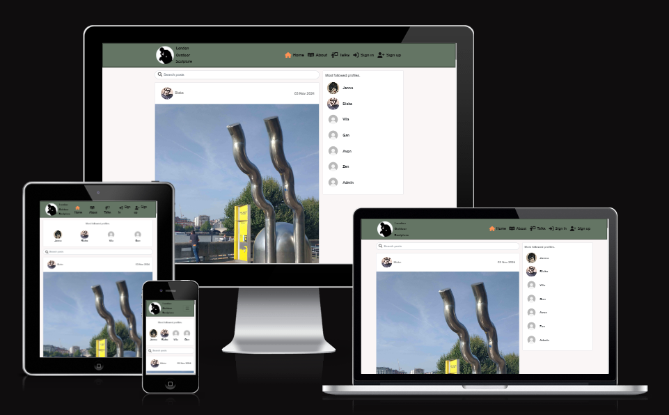

## UX
### Initial Design and Wireframes

I present here the primary wireframes for all pages on small screens with relevant samples for larger screens: : [WIREFRAMES.md](WIREFRAMES.md).

### Colour Scheme

Design and colour should enhance, not distract, so I wanted to adopt a clean and simple design with a primarily white background, and colour for the header and footer, thus allowing the images to be the focus.

The themes of 'outdoor' and 'sculpture' inspired the ideas of 'green' and 'stone' so I explored shades of green and decided for a subtle matte. Black and orange were adopted for the Nav Bar icons to contrast with the green for reasons of aesthetics and accessibility.

I used the [W3 RGB](https://www.w3schools.com/colors/colors_rgb.asp) calculator to select colours, and their use is summarised below:

- `rgb(33, 37, 41)` used for primary text.
- `rgb(19, 19, 19)` used for Nav Bar icons and footer text.
- `rgb(255, 146, 84)` used for Nav Bar icons on-hover.
- `rgb(255, 255, 255)` used for body background.
- `rgb(100, 117, 100)` used for header and footer background.
- [React Bootstrap](https://react-bootstrap.github.io/docs/components/buttons) buttons component used for colouring and functionality.

### Typography

- [Montserrat](https://fonts.google.com/specimen/Montserrat) is used for all text.

- [Font Awesome](https://fontawesome.com) is used for icons in the nav bar.

## User Stories

### Epic 1: Authentication

- As a new user, I would like to create an account so that I can access all the features for signed-up users.
- As a user, I would like to sign in so that I can access functionality for signed-in users.
- As a user, I would like to know if I am signed-in or not so that I can sign in if necessary.
- As a user, I would like to sign out so that I know my session has been closed securely.

### Epic 2: Navigation

- As a user, I would like to view a navbar from every page so that I can navigate seamlessly between pages.
- As a signed-out user, I would like to see sign-in and sign-up options so that I can sign in/sign up.

### Epic 3: Add and Like Posts

- As a logged-in user, I would like to create a post to share on the platform so that I can engage with other users.
- As a logged-in user, I would like to edit my posts so that I can change or update them after their creation.
- As a logged-in user, I would like to like/unlike a post so that I can show my appreciation of the content.
- As a logged-in user, I would like to view all posts I have liked so that I can scroll through my favourite content.

### Epic 4: View Posts

- As a user, I would like to scroll continuously through the posts on any given page so that I can view them without interruption.
- As a user, I would like to view the most recent posts first so that I am up to date with the latest content.
- As a user, I would like to search for posts with keywords so that I can find posts and user profiles that most interest me.
- As a user, I would like to view the details of a single post so that I can learn more about it.
- As a logged-in user, I would like to view posts filtered by users I follow so that I can keep up-to-date with their content.

### Epic 5: Profiles

- As a user, I would like to view other users’ profiles so that I can see their posts and learn more about them.
- As a user, I would like to view a list of the most followed profiles so that I can see which are the most popular.
- As a user, I would like to see all the published posts by a specific user so that I can review their post history.
- As a logged-in user, I would like to follow/unfollow other users so that I can see and remove posts by specific users in my post feed.
- As a logged-in user, I would like to edit my profile so that I can keep my details up to date.
- As a logged-in user, I would like to update my username/password so that I can make changes and keep my account secure.
- As a user, I would like to see stats on a specific user’s profile so I can know how many posts they have made, followers they have, and how many users they are following.

### Epic 6: Comments

- As a user, I would like to view comments by other users so that I can know what they think about posts.
- As a user, I would like to see how long ago a comment was made so that I know how old it is.
- As a logged-in user, I would like to comment on a post so that I can share my thoughts about its content.
- As a logged-in user, I would like to edit any comment I have made so that I can update its content.
- As a logged-in user, I would like to delete any comment I have made so that I can remove it from the site.

### Epic 7: Online Talk Events

- As an administrator, I would like to create an Online Talk event so that I can publish it on the talks page.
- As an administrator, I would like to edit and delete an Online Talk event so that I can amend details and remove the event if necessary.
- As a user, I would like to view all Online Talk events so that I can browse upcoming Online Talks.
- As a logged-in user, I would like to submit a booking for an Online Talk event so that I can learn about my areas of interest.
- As a logged-in user, I would like to view, edit and delete my bookings for Online Talk events so that I can check and change my bookings if necessary.

### Epic 8: Site Administration

- As an administrator, I would like to access the administrator panel so that I can monitor and delete posts, comments and users if necessary.

## Features

### Existing Features

- **Home Page - Public**
    
    - Displays the nav bar, search bar, posts and most followed user profiles.
    - A post comprises an image with title, artist, street, post code and borough, along with the number of likes and comments.
    - Users can enter key words in the search bar to locate posts by title, artist, street, post code and borough, along with profile name.
    - Clicking on a user's avatar redirects to the profile page.

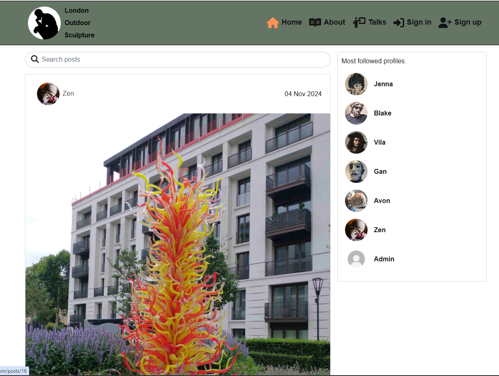

- **Home Page - Logged-in Users**

    - Additional icons on the nav bar for Add image, Bookings, Feed, Liked and Sign out.
    
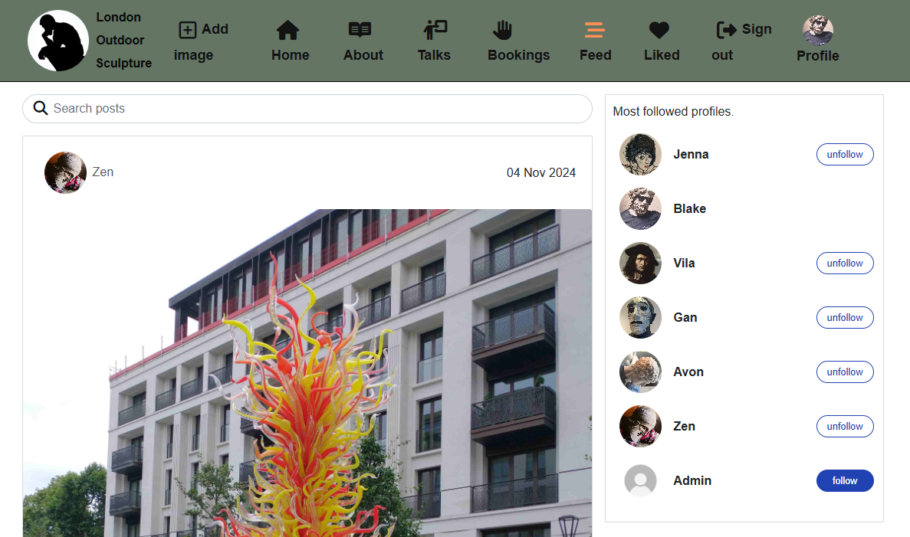

- **Sign in**

    -  Existing user can sign in with username and password.

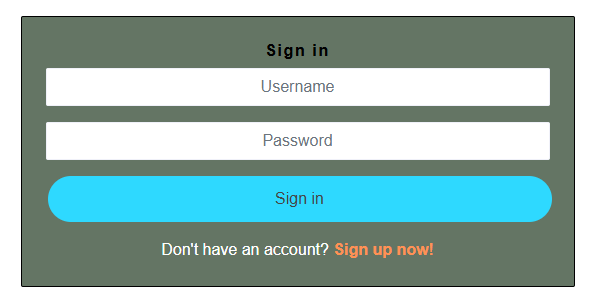

- **Sign up**

    -  New user can sign up by creating username and password.

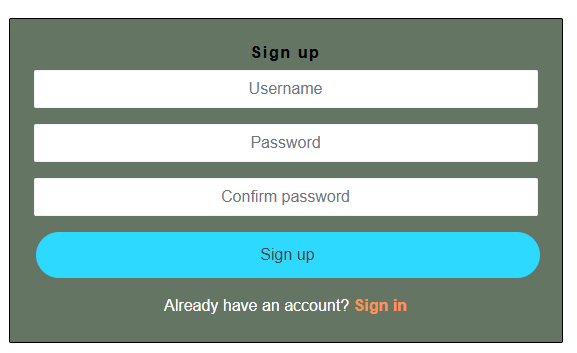

- **Add image**

    - Clicking on 'Add image' enables a logged-in user to upload an image with title, artist, street, post code and borough.

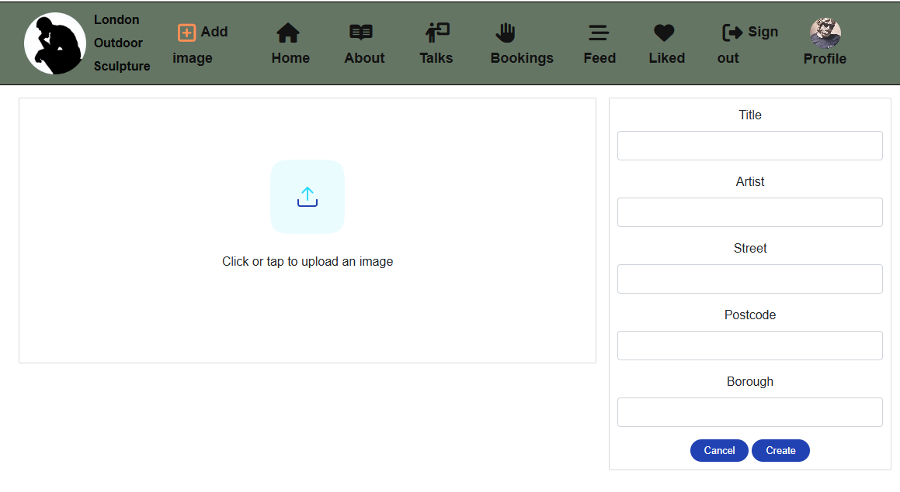

- **Post Page**

    -  Clicking on a post reveals a post page with comments listed below and a logged-in user can add comments.

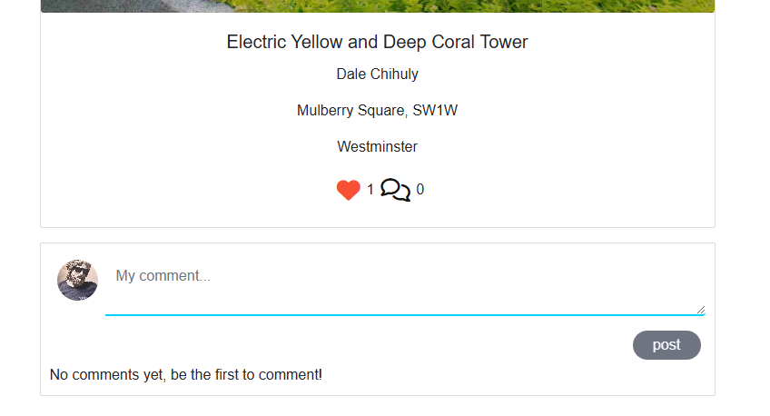

- **Search Bar**

    -  Any user can search by keyword for user, artist, post code, borough etc.

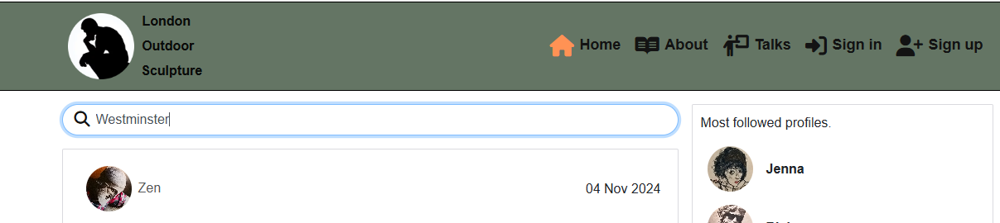

- **Profile Page**

    - Clicking on a profile avatar displays a summary of the user's activity and their posts.

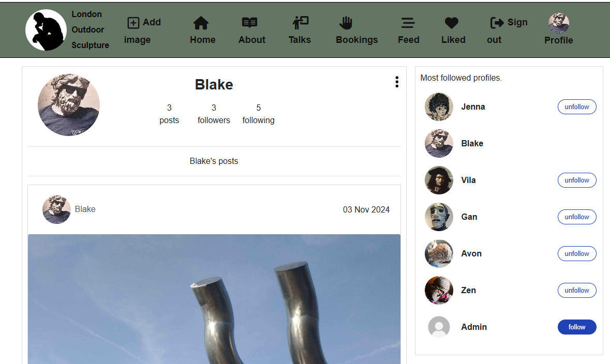

 - - Clicking on the three-dots icon displays edit functions for the profile owner.

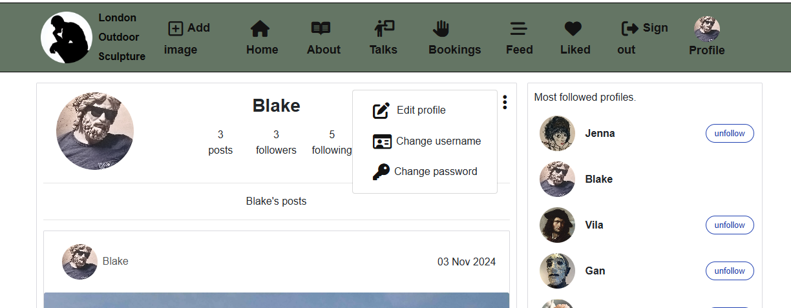

- **About Page**

    - Outlines the purpose of the site with guidelines for uploading images.

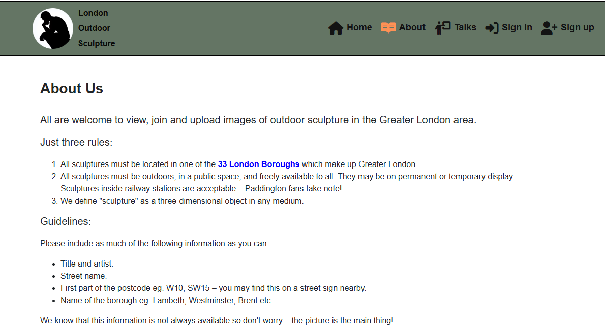

- **Talks Page**

    - Lists online talks available (as added by the site Administrator) and a logged-in user can book their attendance by clicking on Register.

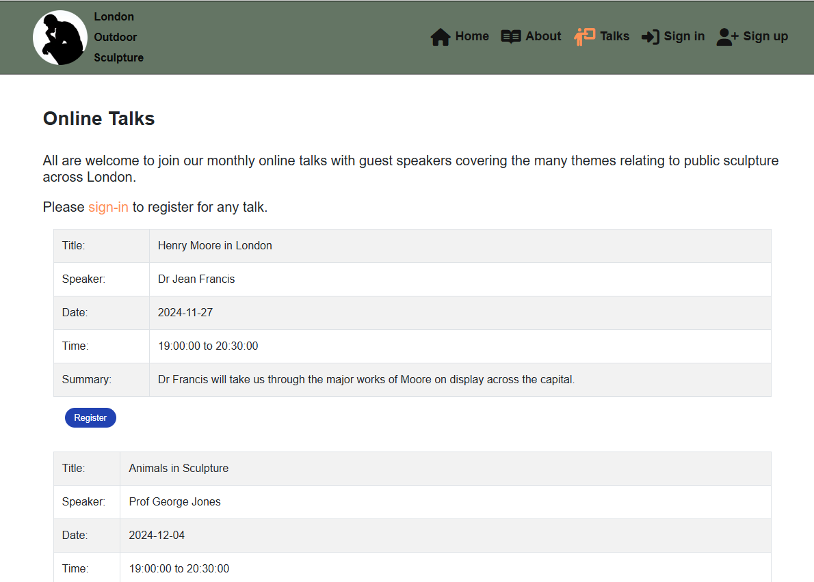

- **Booking Page**

    - Booking form is populated with the selected talk's details and the user can add their questions and/or make suggestions for future topics.


- **Bookings Page**

    - Lists all bookings made by a user with edit and delete options.

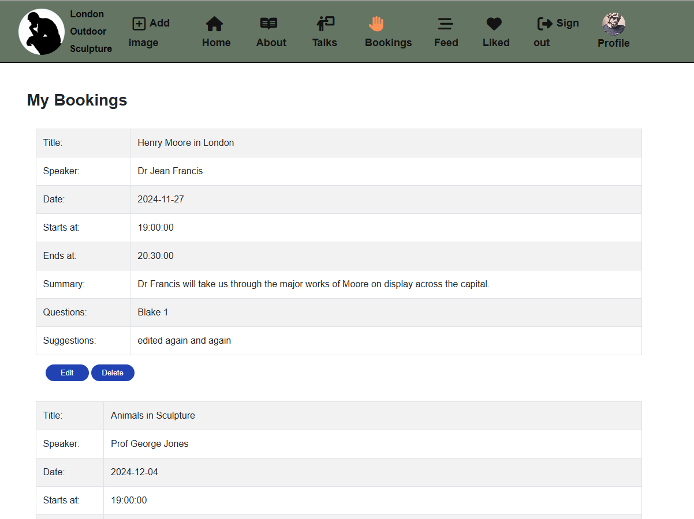

- **Edit Bookings Page**

    - User can edit their question and/or suggestions.

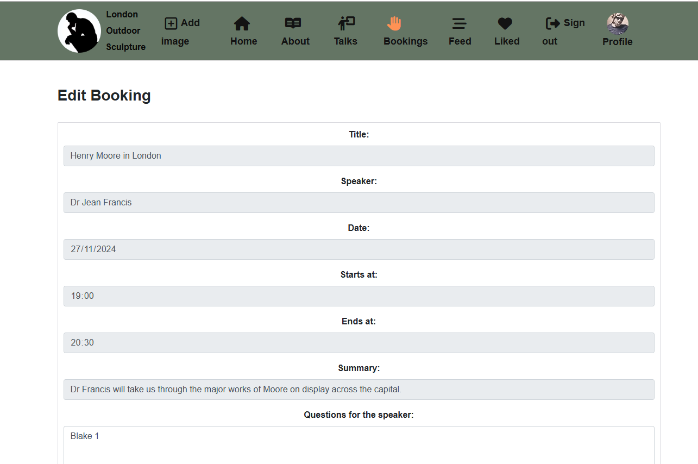

- **Feed Page**

    - Logged-in users can view posts of all users they are following.

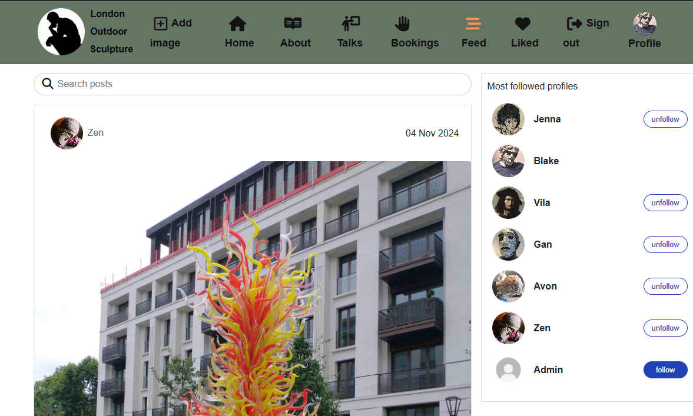

- **Liked Page**

    - Logged-in users can view all posts they have liked.

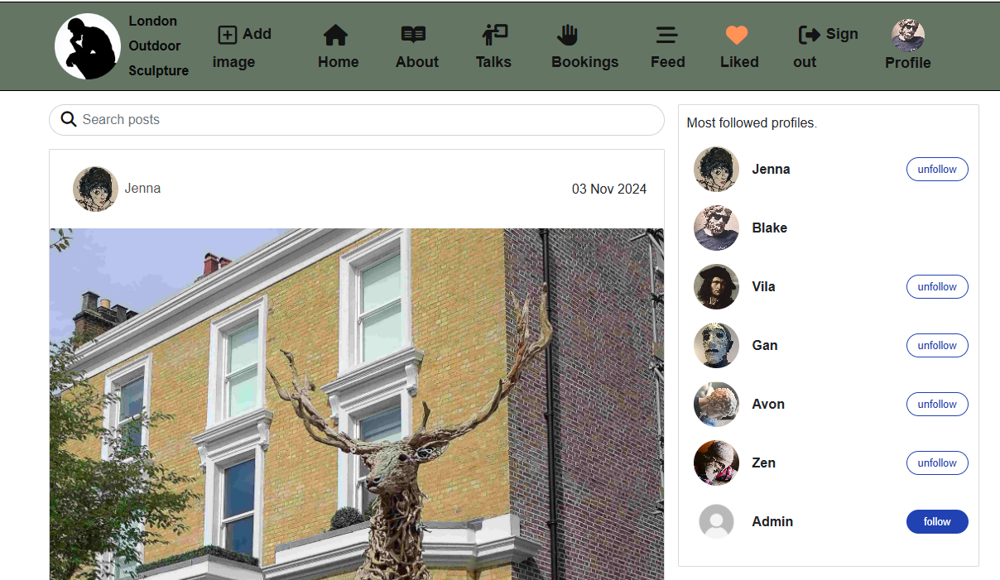

- **Sign out**

    - When a user signs out they are first asked to confirm this action and are then given an onscreen message confirming that they have signed out.


### Future Features

The following features would add to the user experience:

- **Email sign up**

    - Currently, only a username and password are required to sign up/sign in. Adding an email to this would enable additional verification and direct communication to users about updates and events.

- **Blog**

    - A blog function would allow for more user interaction, engagement and sharing of ideas.

## Tools & Technologies Used

- [Markdown Builder](https://tim.2bn.dev/markdown-builder) to generate README and TESTING templates.
- [Git](https://git-scm.com) for version control. (`git add`, `git commit`, `git push`)
- [GitHub](https://github.com) for secure online code storage.
- [Gitpod](https://gitpod.io) as a cloud-based IDE for development.
- [HTML](https://en.wikipedia.org/wiki/HTML) for site content.
- [CSS](https://en.wikipedia.org/wiki/CSS) for site design and layout.
- [React](https://react.dev/) for front-end user interface.
- [Python](https://www.python.org) for back-end programming.
- [Heroku](https://www.heroku.com) for hosting the deployed back-end site.
- [React Bootstrap](https://react-bootstrap.netlify.app/) for the front-end CSS styling.
- [Django](https://www.djangoproject.com) as the Python framework for the site.
- [Dango Rest Framework](https://www.django-rest-framework.org) for building the back-end API.
- [PostgreSQL](https://www.postgresql.org) for relational database management.
- [Neon](https://neon.tech/) to host the PostgreSQL database.
- [Cloudinary](https://cloudinary.com) for online static file storage.
- [Font Awesome](https://fontawesome.com) for icons.
- [Mermaid](https://mermaid.js.org/syntax/entityRelationshipDiagram.html) to generate ERDs for the completed project.

## Database Design

See back-end API README: [Database Design](https://github.com/Adam-Alive/sculpture-drf-api?tab=readme-ov-file#database-design)

## Agile Project Management

### Project Plan and Milestones

I began with a series of brainstorming sessions and then drew up a project plan which served as milestones for tracking on GitHub.

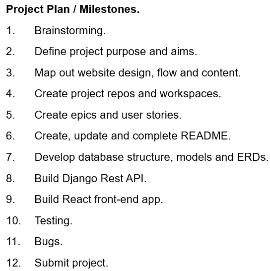

### GitHub Projects and Issues

[GitHub Projects](https://github.com/Adam-Alive/london-outdoor-sculpture/projects?query=is%3Aopen) served as an Agile tool for this project where epics, user stories, issues, and milestones were planned and then tracked on the Kanban board.

Using GitHub's projects and issues framework I created two GitHub projects within the repository, and then developed issues within each:
- [Sculpture Development and Testing](https://github.com/users/Adam-Alive/projects/10)
- [Sculpture User Stories](https://github.com/users/Adam-Alive/projects/9)

I created a user story template to manage user stories and provide here an example of a completed issue:

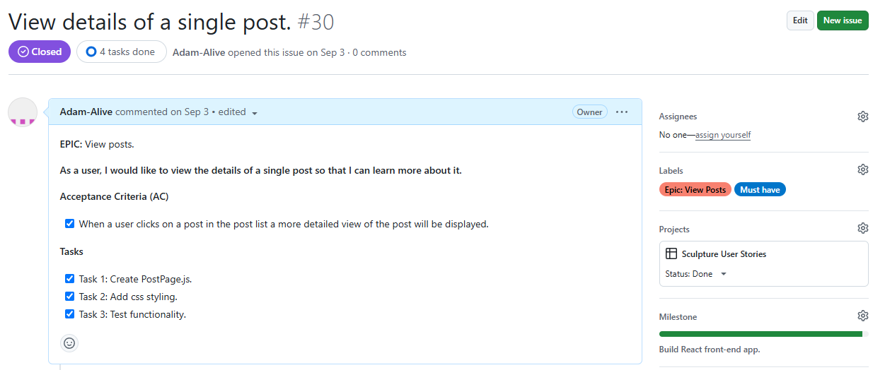

### MoSCoW Prioritisation

I used the MoSCow prioritisation model to add labels to my user stories within the issues tab:

- **Must Have**: guaranteed to be delivered.
- **Should Have**: adds significant value, but not vital.
- **Could Have**: has small impact if left out (and not included for the purposes of this project).
- **Won't Have**: not a priority for this iteration (and not included for the purposes of this project).

### Summary of closed issues:

- [](https://github.com/Adam-Alive/london-outdoor-sculpture/issues)

- [](https://github.com/Adam-Alive/london-outdoor-sculpture/issues?q=is%3Aissue+is%3Aclosed)

## Testing

For all testing, please refer to the [TESTING.md](TESTING.md) file.

## Deployment

The live application is deployed on Heroku at: [London Outdoor Sculpture](https://london-outdoor-sculpture-392a8873bf1b.herokuapp.com/).

### PostgreSQL Database

This project uses a PostgreSQL database at [Neon](https://neon.tech/).

### Cloudinary API

This project uses the [Cloudinary API](https://cloudinary.com) to store media assets online since Heroku doesn't persist this type of data.

### Heroku Deployment

This project uses [Heroku](https://www.heroku.com), a platform as a service (PaaS) that enables developers to build, run, and operate applications entirely in the cloud.

Deployment steps are as follows, after account setup:

- Select **New** in the top-right corner of your Heroku Dashboard, and select **Create new app** from the dropdown menu.
- Your app name must be unique, and then choose a region closest to you (EU or USA), and finally, select **Create App**.
- From the new app **Settings**, click **Reveal Config Vars**, and set your environment variables.

**IMPORTANT:**

This is a sample only - please replace the values with your own if cloning/forking this repository.

| Key | Value |
| --- | --- |
| `CLOUDINARY_URL` | user's own value |
| `DATABASE_URL` | user's own value |
| `DISABLE_COLLECTSTATIC` | 1 (*this is temporary, and can be removed for the final deployment*) |
| `SECRET_KEY` | user's own value |

Heroku needs three additional files in order to deploy properly.

- requirements.txt
- Procfile
- runtime.txt

You can install this project's **requirements** (where applicable) using:

- `pip3 install -r requirements.txt`

If you have your own packages that have been installed, then the requirements file needs updated using:

- `pip3 freeze --local > requirements.txt`

The **Procfile** can be created with the following command:

- `echo web: gunicorn app_name.wsgi > Procfile`
- *replace **app_name** with the name of your primary Django app name; the folder where settings.py is located*

The **runtime.txt** file needs to know which Python version you're using:
1. type: `python3 --version` in the terminal.
2. in the **runtime.txt** file, add your Python version:
    - `python-3.9.18`

For Heroku deployment, follow these steps to connect your own GitHub repository to the newly created app:

Either:

- Select **Automatic Deployment** from the Heroku app.

Or:

- In the Terminal/CLI, connect to Heroku using this command: `heroku login -i`
- Set the remote for Heroku: `heroku git:remote -a app_name` (replace *app_name* with your app name)
- After performing the standard Git `add`, `commit`, and `push` to GitHub, you can now type:
    - `git push heroku main`

The project should now be connected and deployed to Heroku!

### Local Deployment

This project can be cloned or forked in order to make a local copy on your own system.

For either method, you will need to install any applicable packages found within the *requirements.txt* file.

- `pip3 install -r requirements.txt`.

You will need to create a new file called `env.py` at the root-level,
and include the same environment variables listed above from the Heroku deployment steps.

**IMPORTANT:**

This is a sample only - please replace the values with your own if cloning/forking this repository.

Sample `env.py` file:

```python
import os

os.environ.setdefault("CLOUDINARY_URL", "user's own value")
os.environ.setdefault("DATABASE_URL", "user's own value")
os.environ.setdefault("SECRET_KEY", "user's own value")

# local environment only (do not include these in production/deployment!)
os.environ.setdefault("DEBUG", "True")
```

Once the project is cloned or forked, follow these steps run it locally:

- Start the Django app: `python3 manage.py runserver`
- Stop the app once it's loaded: `CTRL+C` or `⌘+C` (Mac)
- Make any necessary migrations: `python3 manage.py makemigrations`
- Migrate the data to the database: `python3 manage.py migrate`
- Create a superuser: `python3 manage.py createsuperuser`
- Load fixtures (if applicable): `python3 manage.py loaddata file-name.json` (repeat for each file)
- Everything should be ready now, so run the Django app again: `python3 manage.py runserver`

#### Cloning

To clone this repository, follow these steps:

1. Go to the [GitHub repository](https://github.com/Adam-Alive/camden-curling-club).
2. Locate the Code button above the list of files and click.
3. Select if you prefer to clone using HTTPS, SSH, or GitHub CLI and click the copy button to copy the URL to your clipboard.
4. Open Git Bash or Terminal.
5. Change the current working directory to the one where you want the cloned directory.
6. In your IDE Terminal, type the following command to clone my repository:
    - `git clone https://github.com/Adam-Alive/camden-curling-club.git`
7. Press Enter to create your local clone.

Alternatively, if using Gitpod, you can click below to create your own workspace using this repository:

[Open in Gitpod](https://gitpod.io/#https://github.com/Adam-Alive/camden-curling-club)

Please note that in order to directly open the project in Gitpod, you need to have the browser extension installed.
A tutorial on this can be found [here](https://www.gitpod.io/docs/configure/user-settings/browser-extension).

#### Forking

By forking the GitHub Repository, we make a copy of the original repository on our GitHub account to view and/or make changes without affecting the original owner's repository.
To fork this repository, follow these steps:

1. Log in to GitHub and locate the [GitHub Repository](https://github.com/Adam-Alive/camden-curling-club)
2. At the top of the Repository (not top of page) just above the "Settings" Button on the menu, locate the "Fork" Button.
3. Once clicked, you should now have a copy of the original repository in your own GitHub account!

## Credits

### Content

| Source | Location | Notes |
| --- | --- | --- |
| [Markdown Builder](https://tim.2bn.dev/markdown-builder) | README and TESTING | An excellent tool to help generate the Markdown files |
| [John Abdsho](https://www.youtube.com/watch?v=s5xbtuo9pR0) | bookings | Initial ideas on how to create a booking system with Django|
| [W3Schools](https://www.w3schools.com/bootstrap5/) | gallery and bookings | Additional support with Bootstrap grids and modals|
| [Stack Overflow](https://stackoverflow.com/questions/21938028/how-to-get-a-favicon-to-show-up-in-my-django-app) | favicon | How to get favicon to show in Django app |
| [Scottish Curling](https://www.scottishcurling.org/) |  home and faqs  | Reference  |
| [British Curling](https://www.britishcurling.org.uk/) |  home and faqs  | Reference  |

### Media

| Source | Location | Type | Notes |
| --- | --- | --- | --- |
| [Free Images](https://www.freeimages.com/) | home and gallery | images | Various images of curling |
| [Pexels](https://www.pexels.com/) | home and gallery  | images | Various images of curling  |
| [Pixelied](https://pixelied.com/convert/jpg-converter/jpg-to-webp) | home and gallery  | images | Convert png to webp |

### Acknowledgements

- I would like to thank my Code Institute mentor, Mitko Bachvarov, for his guidance and support throughout the development of this project.

