# Testing
 
> Return to the [README.md](README.md) file.
 
## Code Validation
 
### HTML
 
I used the [HTML W3C Validator](https://validator.w3.org) to validate all HTML files.

- Result: Pass, no errors:

 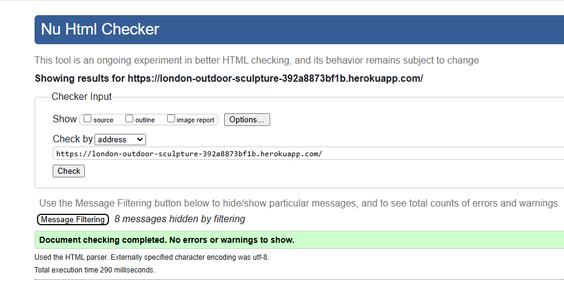 

### CSS
 
I used the [CSS Jigsaw Validator](https://jigsaw.w3.org/css-validator) to validate the CSS file.

An example of a test for About.module.css is shown here, with full results listed below.
 
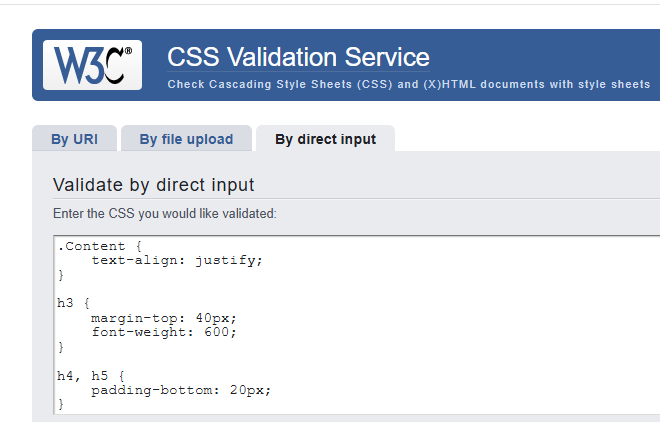
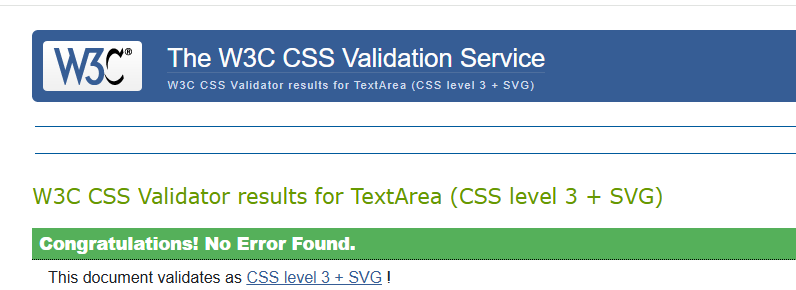 

 | Filename | Result |
| --- | --- |
|About.module.css |Pass|
|Asset.module.css|Pass|
|Avatar.module.css |Pass|
| BookingCreateEditForm.module.css| Pass|
| Bookings.module.css| Pass|
|Bookings.module.css | Pass|
|Button.module.css| Pass|
|Comment.module.css | Pass|
| CommentCreateEditForm. module.css| Pass|
|Footer.module.css |Pass |
|MoreDropdown.module.css |Pass |
|NavBar.module.css |Pass |
|NotFound.module.css | Pass|
|Post.module.css | Pass|
|PostCreateEditForm.module.css | |
|PostsPage.module.css |Pass |
|Profile.module.css | Pass|
|SignInUpForm.module.css |Pass |
|TalksPage.module.css | Pass|
 
### JSX

All JSX code was passed through [ESLint](https://eslint.org/), installed in my Gitpod workspace and providing real-time validation. 

- Result: Pass, no errors:
 
 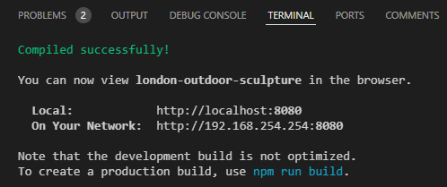 

## Browser Compatibility

I've tested my deployed project on Chrome, Edge and Safari to check for compatibility issues.
 
I tested each browser on the homepage, and then logged in to view each feature. I have provided a summary of these tests below with a screenshot of the homepage.
 
| Browser | Home | Notes |
| --- | --- | --- |
| Chrome | 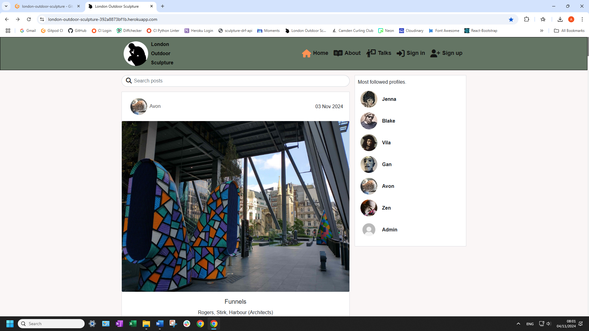 | Works as expected |
| Edge | 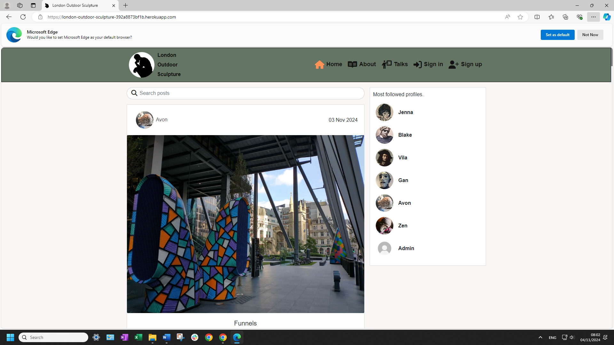 | Works as expected |
| Safari | 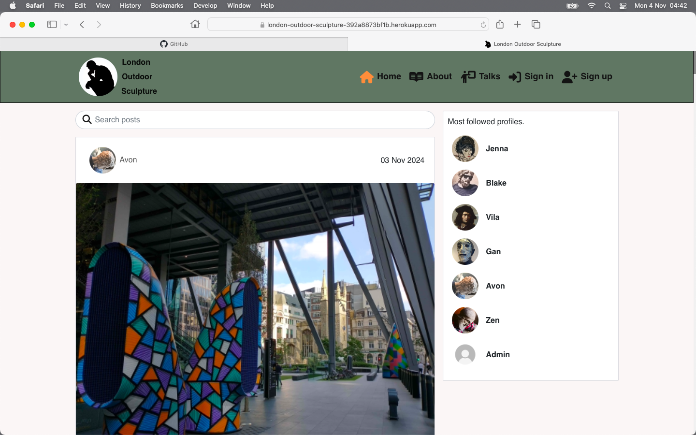 | Works as expected |
 
## Responsiveness
 
I deployed the project early on and tested on three of my own devices throughout the development process:
 
- Moto (g8) power
- HP Desktop (24")
- MacBook Air (13")
 
I also used Dev Tools to test on a tablet device.
 
I tested the responsiveness of each page and have provided a summary of these tests below with a screenshot of the homepage:
 
| Device | Home | Notes |
| --- | --- | --- |
| Moto(g8) mobile (own) | 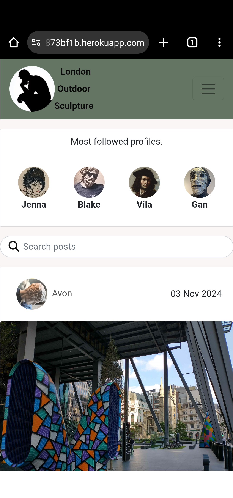 | Works as expected |
| Tablet (DevTools) | 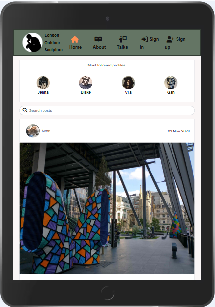 | Works as expected |
| MacBook Air (own) | 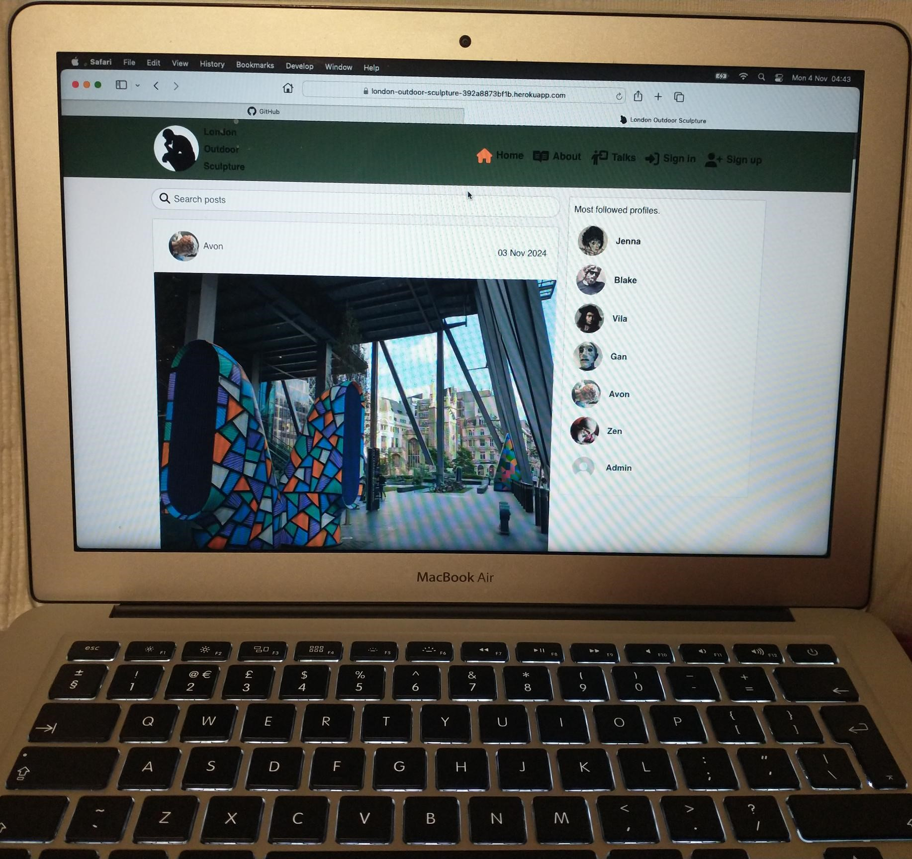 | Works as expected |
| HP Desktop (own) | 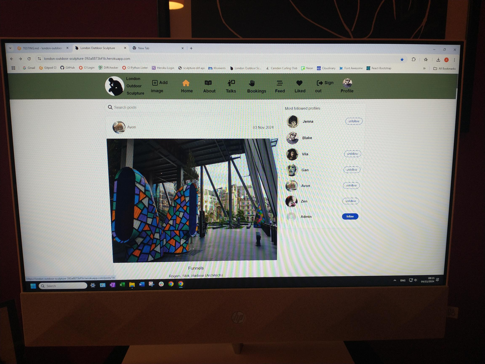 | Works as expected |
 
## Lighthouse Audit
 
I tested the deployed project using the Lighthouse Audit tool to check for any major issues and a summary is provided below:
 
| Page | Mobile | Desktop |
| --- | --- | --- |
| Home |  |  |
| Bookings |  |  | |
| FAQS |  |  |
| Gallery|  |  |
| Network|  |  |
| Logout |  |  |

 ## User Story Testing
  
 I conducted manual tests for user stories and a summary is provided below:
  
 | User Story | Screenshot |
 | --- | --- |
 | As a new user, I would like to land on an informative and engaging home page so that I can learn about the club.|  |
 |  As a new user, I would like to submit my contact details so that I can register my membership. |  |
 |  As a member, I would like to enter my login details so that I can access the members' area. |  |
 |  As a member, I would like to logout so that I can know my session has been closed securely. |   |
 |  As a member, I would like to book a practice session so that I can attend at a time that suits me. |  |
 |  As a member, I would like to amend or cancel a practice session so that I can change my plans. |  |
 |  As a member, I would like to add images to the gallery so that I can share my curling experiences with other members. |    |
 | As a site administrator, I would like to access the administrator panel so that I can manage the club membership and site's pages. |    |
 |  As a site administrator, I would like to manage content on the FAQs page so that I can provide information to members.|   |
 |  As a site administrator, I would like to approve or delete images added to the gallery so that I can filter out any objectionable material.|  |
 |  As a site administrator, I would like to manage content on the curling network page so that I can keep members informed of other curling venues. |   |
  
 ## Automated Testing
  
 I conducted a series of automated tests on my application and acknowledge that, in a real-world scenario, an extensive set of additional tests would be required.
 
 ## Bugs
 
 - **Issue:** Favicon only showing on home page.
  
 - **Fix:** Research on Stack Overflow suggested I link to the favicon from the base.html using Django template language, rather than html, and this solved the problem:

    **Before:**

    **After:**

## Unfixed Bugs

Duplicate bookings.
