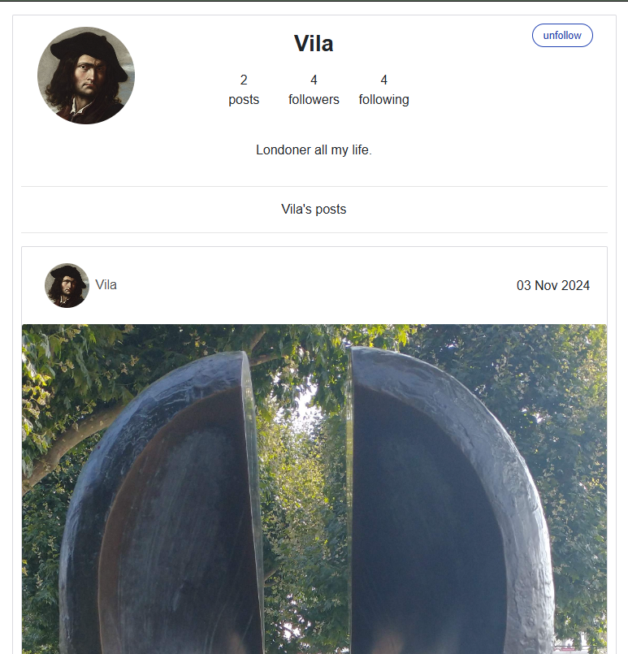

# Testing
 
> Return to the [README.md](README.md) file.
 
## Code Validation
 
### HTML
 
I used the [HTML W3C Validator](https://validator.w3.org) to validate all HTML files.

- Result: Pass, no errors:

  

### CSS
 
I used the [CSS Jigsaw Validator](https://jigsaw.w3.org/css-validator) to validate the CSS file.

An example of a test for About.module.css is shown here, with full results listed below.
 

 

 | Filename | Result |
| --- | --- |
|About.module.css |Pass|
|Asset.module.css|Pass|
|Avatar.module.css |Pass|
| BookingCreateEditForm.module.css| Pass|
| Bookings.module.css| Pass|
|Bookings.module.css | Pass|
|Button.module.css| Pass|
|Comment.module.css | Pass|
| CommentCreateEditForm.module.css| Pass|
|Footer.module.css |Pass |
|MoreDropdown.module.css |Pass |
|NavBar.module.css |Pass |
|NotFound.module.css | Pass|
|Post.module.css | Pass|
|PostCreateEditForm.module.css |Pass |
|PostsPage.module.css |Pass |
|Profile.module.css | Pass|
|SignInUpForm.module.css |Pass |
|TalksPage.module.css | Pass|
 
### JSX

All JSX code was passed through [ESLint](https://eslint.org/), installed in my Gitpod workspace and providing real-time validation. 

- Result: Pass, no errors:
 
  

## Browser Compatibility

I've tested my deployed project on Chrome, Edge and Safari to check for compatibility issues.
 
I tested each browser on the homepage, and then logged in to view each feature. I have provided a summary of these tests below with a screenshot of the homepage.
 
| Browser | Home | Notes |
| --- | --- | --- |
| Chrome |  | Works as expected |
| Edge |  | Works as expected |
| Safari |  | Works as expected |
 
## Responsiveness
 
I deployed the project early on and tested on three of my own devices throughout the development process:
 
- Moto (g8) power
- HP Desktop (24")
- MacBook Air (13")
 
I also used Dev Tools to test on a tablet device.
 
I tested the responsiveness of each page and have provided a summary of these tests below with a screenshot of the homepage:
 
| Device | Homepage | Notes |
| --- | --- | --- |
| Moto(g8) mobile (own) || Works as expected |
| Tablet (DevTools) | | Works as expected |
| MacBook Air (own) | | Works as expected |
| HP Desktop (own) | | Works as expected |
 
## Lighthouse Audit
 
I tested the deployed project using the Lighthouse Audit tool to check for any major issues and a summary is provided below:
 
| Page | Mobile | Desktop |
| --- | --- | --- |
| Home |  ||
| Bookings |  | | |
| FAQS |  |  |
| Gallery|  |  |
| Network|  |  |
| Logout |  |  |

 ## User Story Testing  
 I conducted manual tests for user stories and a summary is provided below:

**Epic 1: Authentication**
| User Story | Screenshot |
| --- | --- |
|As a new user, I would like to create an account so that I can access all the features for signed-up users. |  |
| As a user, I would like to sign in so that I can access functionality for signed-in users. |  |
|  As a user, I would like to know if I am signed-in or not so that I can sign in if necessary. |  |
|  As a user, I would like to sign out so that I know my session has been closed securely. |   |

**Epic 2: Navigation**
| User Story | Screenshot |
| --- | --- |
| As a user, I would like to view a navbar from every page so that I can navigate seamlessly between pages. |  |
|  As a signed-out user, I would like to see sign-in and signup options so that I can sign in/sign up. |  |

**Epic 3: Add and Like Posts**
| User Story | Screenshot |
| --- | --- |
|  As a logged-in user, I would like to create a post to share on the platform so that I can engage with other users. |   |
| As a logged-in user, I would like to edit my posts so that I can change or update them after their creation. |  |
|  As a logged-in user, I would like to like/unlike a post so that I can show my appreciation of the content. |  |
|   As a logged-in user, I would like to view all posts I have liked so that I can scroll through my favourite content. |   |

**Epic 4: View Posts**
| User Story | Screenshot |
| --- | --- |
|   As a user, I would like to scroll continuously through the posts on any given page so that I can view them without interruption. |   |
|  As a user, I would like to view the most recent posts first so that I am up to date with the latest content. |  |
|   As a user, I would like to search for posts with keywords so that I can find posts and user profiles that most interest me. |   |
|  As a user, I would like to view the details of a single post so that I can learn more about it. |  |
|  As a logged-in user, I would like to view posts filtered by users I follow so that I can keep up-to-date with their content. |  |

**Epic 5: Profiles**
| User Story | Screenshot |
| --- | --- |
| As a user, I would like to view other users’ profiles so that I can see their posts and learn more about them. |  |
| As a user, I would like to view a list of the most followed profiles so that I can see which are the most popular. |  |
|  As a user, I would like to see all the published posts by a specific user so that I can review their post history. |  |
|   As a logged-in user, I would like to follow/unfollow other users so that I can see and remove posts by specific users in my post feed. |   |
|  As a logged-in user, I would like to edit my profile so that I can keep my details up to date. |  |
|  As a logged-in user, I would like to update my username/password so that I can make changes and keep my account secure. |   |
|  As a user, I would like to see stats on a specific user’s profile so I can know how many posts they have made, followers they have, and how many users they are following. |  |

**Epic 6: Comments**
| User Story | Screenshot |
| --- | --- |
|  As a user, I would like to view comments by other users so that I can know what they think about posts. |  |
|   As a user, I would like to see how long ago a comment was made so that I know how old it is. |  |
|  As a logged-in user, I would like to comment on a post so that I can share my thoughts about its content. |  |
|   As a logged-in user, I would like to edit any comment I have made so that I can update its content. |  |
|   As a logged-in user, I would like to delete any comment I have made so that I can remove it from the site. |  |

**Epic 7: Online Talk Events**
| User Story | Screenshot |
| --- | --- |
|   As an administrator, I would like to create an Online Talk event so that I can publish it on the talks page. |  |
|   As an administrator, I would like to edit and delete an Online Talk event so that I can amend details and remove the event if necessary. |  |
|   As a user, I would like to view all Online Talk events so that I can browse upcoming Online Talks. |  |
|   As a logged-in user, I would like to submit a booking for an Online Talk event so that I can learn about my areas of interest. |  |
|   As a logged-in user, I would like to view, edit and delete my bookings for Online Talk events so that I can check and change my bookings if necessary. |  |

**Epic 8: Site Administration**
| User Story | Screenshot |
| --- | --- |
| As an administrator, I would like to access the administrator panel so that I can monitor and delete posts, comments and users if necessary. |  |

  
 ## React Unit Testing

 I conducted a series of automated tests on the NavBar.js component (see: [NavBar.test.js](https://github.com/Adam-Alive/london-outdoor-sculpture/blob/main/src/components/__tests__/NavBar.test.js)) and acknowledge that, in a real-world scenario, an extensive set of additional tests would be required.

 - Result: Pass, no errors:

 
 
 
 ## Bugs
 
 - **Issue:** Favicon only showing on home page.
  
 - **Fix:** Research on Stack Overflow suggested I link to the favicon from the base.html using Django template language, rather than html, and this solved the problem:

    **Before:**

    **After:**

## Unfixed Bugs

Duplicate bookings.
